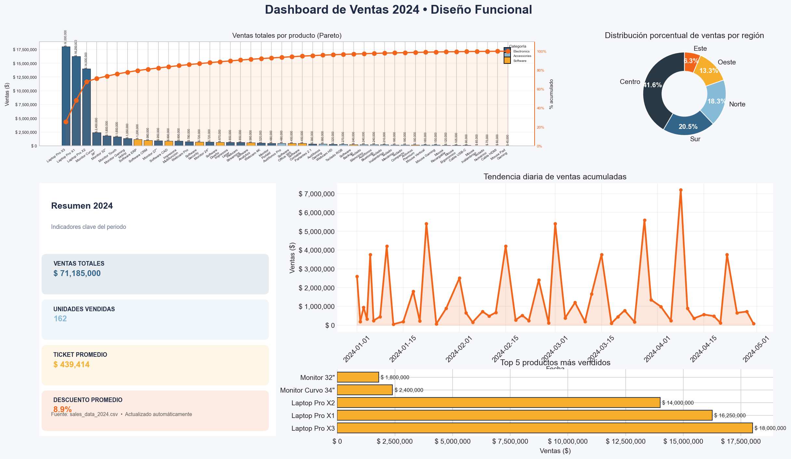
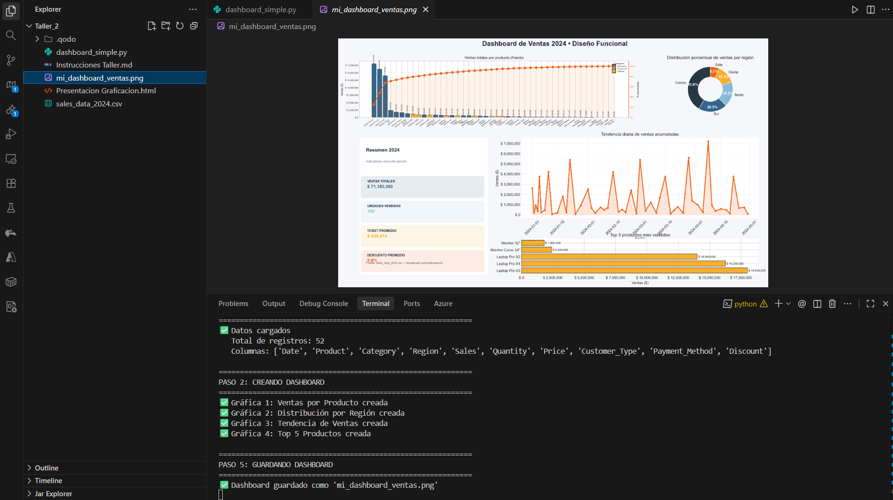

# Dashboard de Ventas 2024

Dashboard desarrollado para el Taller de Diseño Funcional (Semestre VIII) que visualiza las ventas del dataset `sales_data_2024.csv` y genera evidencias en formato PNG.

## Vista rápida

<p align="center">
  
</p>

<p align="center">
  
</p>

## Contenido del Proyecto

- `dashboard_simple.py`: script principal con las visualizaciones.
- `sales_data_2024.csv`: dataset base con 52 registros.
- `mi_dashboard_ventas.png`: dashboard exportado automáticamente.
- `image.png`: captura del IDE mostrando la ejecución y generación del dashboard.

## Requisitos

- Python 3.9+
- Paquetes: `matplotlib`, `pandas` (el script importa `pathlib`, `textwrap` y `matplotlib.patches`, pero no requieren instalación adicional).

Instalación rápida:
```bash
pip install matplotlib pandas
```

## Ejecución

1. Ubicarse en la carpeta del proyecto:
   ```bash
   cd Taller_2
   ```
2. Ejecutar el script:
   ```bash
   python dashboard_simple.py
   ```
3. El programa imprimirá el progreso en consola y guardará automáticamente `mi_dashboard_ventas.png`.

## Visualizaciones Incluidas

1. **Ventas totales por producto (Pareto)** – barras coloreadas por categoría + línea de % acumulado.
2. **Distribución porcentual por región** – gráfico de dona con etiquetas de porcentaje.
3. **Tendencia diaria de ventas** – línea acumulada con área sombreada.
4. **Top 5 productos** – barras horizontales destacando los montos de venta.
5. **Resumen 2024** – tarjetas KPI con ventas totales, unidades, ticket promedio y descuento promedio.

## Evidencias

- `mi_dashboard_ventas.png`: resultado final del dashboard (mostrado arriba).
- `image.png`: evidencia de ejecución en VS Code mostrando mensajes de consola y la vista previa del PNG.

## Personalización

- Paleta de colores definida en `dashboard_simple.py` (`palette` y `accent_color`).
- Layout configurable mediante `GridSpec` para reorganizar gráficas.
- Guardado automático configurable en la sección "PASO 5" del script (`plt.savefig`).
